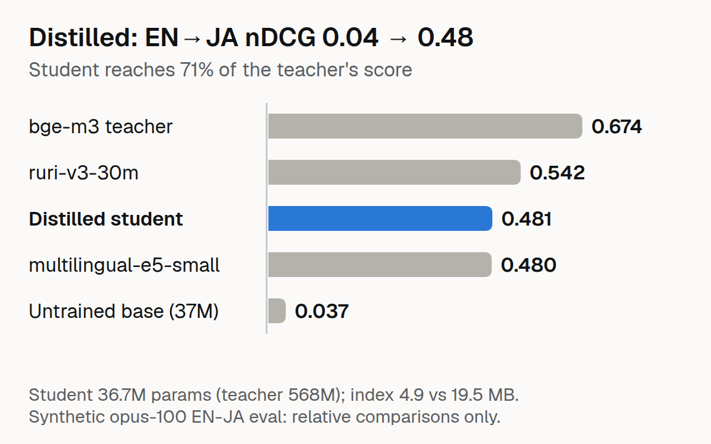

# Tiny Bilingual Retriever



Distill BAAI/bge-m3 (568M) into sbintuitions/modernbert-ja-30m (the "30M" model; 36.7M parameters including embeddings) for English-Japanese cross-lingual retrieval on CPU.

## The problem

Tokyo companies with global customers need English queries to find Japanese documents. A 568M model is too big for CPU serving. Can a ~37M student match the teacher's cross-lingual quality?

## The approach

1. **Distill** bge-m3 into modernbert-ja-30m using EN-JA sentence pairs
2. **Compress** with Matryoshka truncation, int8/binary quantisation, ONNX Runtime
3. **Fuse** with MeCab-segmented BM25 via RRF
4. **Measure** quality kept vs index MB vs CPU ms

## Results

### Baselines (500 queries, 5,000 passages)

| Model | JA-JA nDCG@10 | EN-JA nDCG@10 | p50 | Index MB |
|---|---|---|---|---|
| cl-nagoya/ruri-v3-30m | 0.9604 | 0.5418 | 4.9ms | 4.9 |
| BAAI/bge-m3 (teacher) | 0.9421 | 0.6742 | 9.7ms | 19.5 |
| intfloat/multilingual-e5-small | 0.9113 | 0.4795 | 6.0ms | 7.3 |
| sbintuitions/modernbert-ja-30m | 0.3223 | 0.0373 | 3.6ms | 4.9 |

### After distillation (50k pairs, 3 epochs, cosine similarity loss)

| Model | JA-JA nDCG@10 | EN-JA nDCG@10 | vs teacher | Index MB |
|---|---|---|---|---|
| BAAI/bge-m3 (teacher) | 0.9421 | 0.6742 | 100% | 19.5 |
| **student-distilled** | 0.2179 | **0.4809** | **71%** | **4.9** |

### After Matryoshka fine-tune (2 epochs)

| dim | EN-JA nDCG@10 | vs dim=256 | Index MB | p50 |
|---|---|---|---|---|
| 256 | 0.4158 | 100% | 4.9 | 4.5ms |
| 128 | 0.3989 | 96% | 2.4 | 4.7ms |
| 64 | 0.3613 | 87% | 1.2 | 0.5ms |

**Key finding:** The student captures 71% of the teacher's EN-JA quality with 15× fewer parameters (36.7M vs 568M) and a 4× smaller index (4.9 vs 19.5 MB). Matryoshka truncation lets you choose the quality/size trade-off at serving time: dim=64 keeps 87% of the dim-256 Matryoshka model's score at 1/4 its index. Two caveats on that number: the Matryoshka fine-tune itself cost quality at full width (EN-JA nDCG 0.4809 distilled → 0.4158 at dim 256), and measured against the teacher, dim 64 is 54% (0.3613 vs 0.6742).

### Hybrid fusion (RRF, k=60)

| eval | Dense | BM25 (MeCab) | RRF fusion |
|---|---|---|---|
| JA-JA | 0.1545 | **0.8123** | 0.4334 |
| EN-JA | **0.4158** | 0.0166 | 0.2049 |

**Fusion finding:** RRF hurts when one method dominates. The student is strong at EN-JA but weak at JA-JA; BM25 is the reverse. Fusing a strong method with a weak one drags the strong method down. Hybrid only helps when both methods are reasonably good on the same query type.

### After JA-JA training (JQaRA, 3 epochs)

| Model | JA-JA nDCG@10 | EN-JA nDCG@10 |
|---|---|---|
| student-matryoshka | 0.1545 | **0.4158** |
| student-ja-en | **0.4348** | 0.2632 |

**Trade-off:** JA-JA training improves monolingual retrieval (0.15→0.43) but degrades cross-lingual (0.42→0.26). The student becomes more balanced but loses its EN-JA specialty.

### Quantisation (int8 and binary)

| Method | EN-JA nDCG@10 | vs float32 | Index MB |
|---|---|---|---|
| float32 | 0.4158 | 100% | 4.9 |
| int8 | 0.4143 | 99.6% | 1.2 |
| binary | 0.0322 | 7.7% | 0.2 |

**int8 is nearly free** — 99.6% quality at 1/4 the index size. Binary is catastrophic — the sign of each element loses too much information.

## Usage

```bash
# Baselines
PYTHONPATH=src python scripts/run_baselines.py

# Train student
PYTHONPATH=src python scripts/train_student.py

# Compress
PYTHONPATH=src python scripts/compress.py

# Hybrid fusion
PYTHONPATH=src python scripts/run_fusion.py
```

## Limitations

- EN-JA eval is synthetic (opus-100 pairs), not a standard benchmark
- Absolute nDCG inflated by subsampling; only relative comparisons meaningful
- Student starts with no retrieval training; distillation quality depends on teacher
- The public cl-nagoya/ruri-v3-30m (same size) scores higher on both JA-JA (0.96 vs 0.22) and EN-JA (0.54 vs 0.48): this is a measured recipe and cost table, not a state-of-the-art model
- Latency is PyTorch on CPU, single measurement; the p50 drop from 4.7 ms (dim 128) to 0.5 ms (dim 64) looks like measurement noise, not a 10× speed-up. `scripts/compress.py` contains an ONNX export path; no ONNX numbers are reported here

## License

MIT
